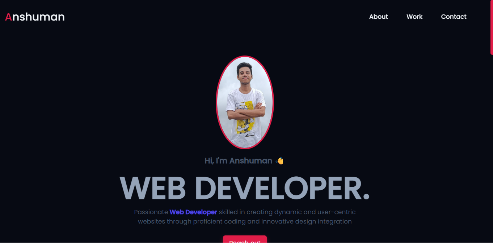
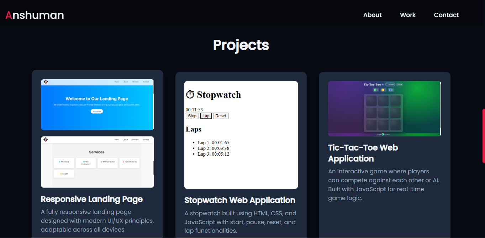

📌 Anshuman’s Portfolio

A personal portfolio website built with HTML, CSS, and JavaScript to showcase my skills, projects, and contact information.

🌐 Live Demo → (add link if you host it on GitHub Pages / Vercel / Netlify)

✨ Features

Responsive design — works across desktop, tablet, and mobile.

Modern UI with smooth scroll and blur header.

Sections:

Home → Introduction with profile image.

About → Skills, education, and personal details.

Projects → Showcasing my web development projects with screenshots.

Contact → Email, phone, and social links.

Custom favicon support.

🛠️ Tech Stack

HTML5

CSS3 (Flexbox, Grid, Variables)

JavaScript (Vanilla JS)

Font Awesome
 (icons)

Google Fonts (Poppins & Roboto)

📂 Folder Structure
portfolio/
│── index.html          # Main HTML file
│── assets/
│   ├── style.css       # Stylesheet
│   ├── script.js       # JavaScript file
│   ├── favicon.ico     # Website favicon
│   ├── img/            # Images & screenshots
│── README.md           # Project documentation

🚀 Getting Started
1. Clone the Repository
git clone https://github.com/<your-username>/<repo-name>.git

2. Open in Browser

Simply open index.html in your preferred browser.

## 📸 Screenshots  

### 🏠 Home Section  
  

### 📂 Projects Section  

